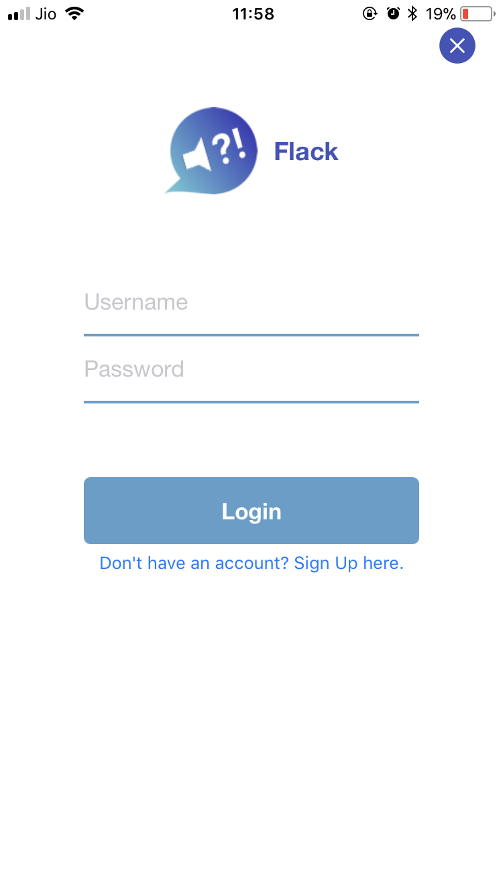
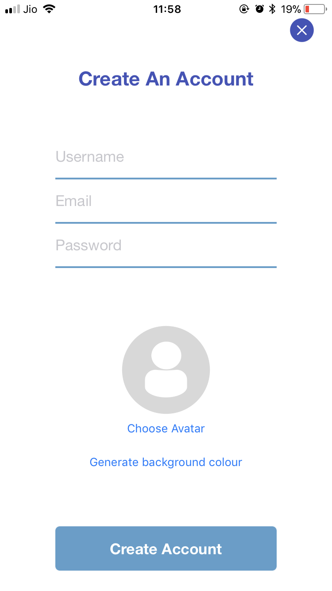
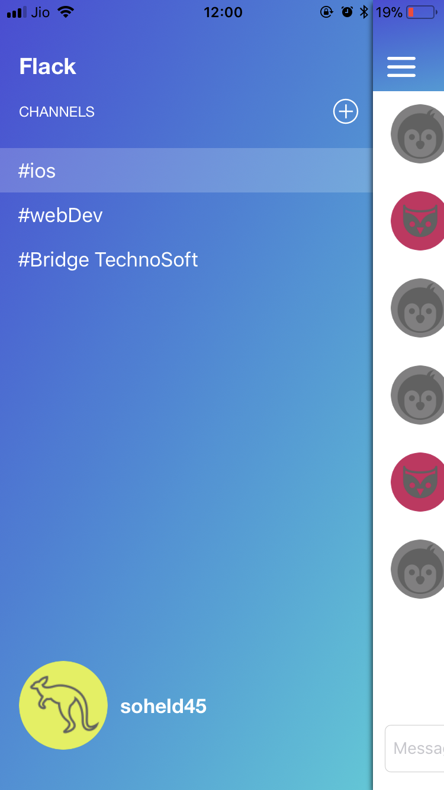
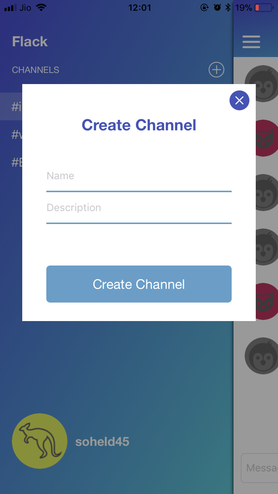

# Flack_App <br>
This app is a mockup/clone of slack.
<br>

### Pods Used :
```pod 'Alamofire'```<br>
```pod 'SwiftyJSON'```<br>
```pod 'Socket.IO-Client-Swift'```

<br>

### API Used: 
Chat App REST API with ES6 and Express.

- ES6 support via [babel](https://babeljs.io)
- Express is Node.js web application framework via [express](https://github.com/expressjs/express)
- Passport authentication for Node.js via [passport](https://github.com/passport)
- Socket.IO enables real-time bidirectional event-based communication via [socket.io](https://github.com/socketio/socket.io)
- Mongoose is a MongoDB object modeling tool via [mongoose](https://github.com/Automattic/mongoose)
- Body Parsing via [body-parser](https://github.com/expressjs/body-parser)
<br>

### Screenshots:

    
